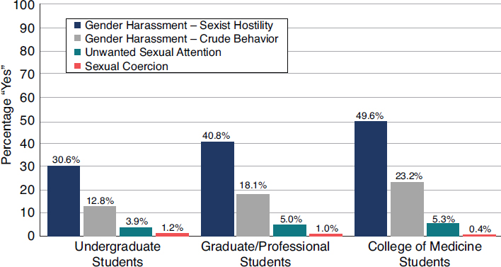
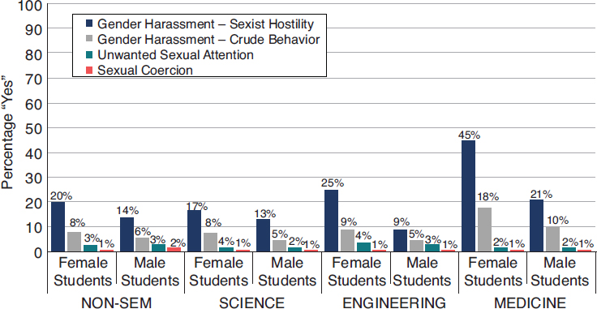

<!> I don't recommend to watch all video listed below! some are of low audio quality and difficult to watch, or have sometimes outdated sources, or an overall approach I don't agree with. This is just part of a project of building both a wide array of references, and extracting a few good recomentations to give out.

Best seen so far: 
 * COMPA videos (French)
 * Preventing Sexual Harassment in Academia
 * Beyond Bias Fair and Inclusive Hiring Strategies for University Search Committees
 * Susanne Täuber - Bullying as a career tool in academia 

## COMPA, série de courte vidéo , prévention VSS harcélemt discrimination à l'université
https://www.youtube.com/@COMPA-IRD/videos

10 vidéos: 2m15+2m23+4m33+5m05+4m09+3m41+8m11+3m25+4m36+2m33 ~40 minutes

1 - définir pour déconstruire - Définit plusieurs termes
violences VSS environnement patriarchale culture du viol  agissements sexistes  sexisme ordinaire  harcélement sexuel corruption sexuel

2- vox pop - doctorantes "il s'approcher trop près de moi, et moi ça me faisait peur" "comment savoir que le consentement est éclairé"
Pouvoir parler, avant/prévention, pendant, après/réparation

3- la pieuvre VSS. pb de tous les endroits où y a trop de pouvoir concentrer sur une personne (eg sport, politique, cinéma, star). Evidemment dans la recherche aussi
   les encadrants ont un pouvoir sur les doctorant. <!> Domination.

   -> il faut généraliser les enquêtes internes
   -> il faut créer des cadres, AVANT, les pb graves.

   -> mais, pour les univs/labos, en parler = mauvaise pub. C'est l'inverse ! ICI, c'est safe.
   
4- Avancer   
    conséquence globale, sur vie pro et vie perso
	honte, culpabilité, peur de pas être cru, peur des représailles
	"survivantes" vs "victimes", pour être dans un mouvement, être victime ne nous définit pas toute notre vie.
	soins : thérapie, être écouter, l'art
	récits de vie: permets de comprendre les méchanismes
	"traumatisme vicariant" = traumatisme des gens qui accompagnent
	le collectif -> analyser ensemble nos pratiques
	avoir conscience de la violence qu'on peut générer ou recevoir
	
5 - vitcime ou témoin, que faire
   porter plainte, accompagnement cellule univ ou assos
   réagir au VSS: sidération, colère, maletre, dénis, peur.
   agir pour soi et pour les autres, ne pas rester seul.
   peurs de se sentir coupable, du regard de l'autre, de pas être cru, de perdre son financement, sa carrière.
   Vous n'êtes pas resonsable
   
   témoin: faire semblant de connaitre la victime. qualifier la situation. accompagner la personne et être à l'écoute. Rassurer, proposer d'appeler un proche.
   
   a faire:
   Briser la loi du silence
   Que les personnes en positions de management interviennent directement
   L'entourage doit prendre conscience de la posture d'allié (soutient, accompagnement, croire)
   Action de prévention, formation et sensibiliations
   
   
6 - le dispositif à Aix Marseille Uni

7- enjeu instituionnel et biais inconscient
  stéréotype : croyance sur des charactérisques propre à X vs Y. (compétences/incompétences souvent)
  biais cognitif : erreurs de perception jugement, via simplification, sur généralisation
  -> test de Stroop: incongruence mot de la couleur/couleur de l'écriture, pour voir la force des automatismes
  
  stéréotype = omniprésent (et la parité ne suffit pas)
  
  reco aux uni: avoir des services de pro à part entière - des gens dédiés à recuillir, traiter 
  reco aux encadrantes/directions: suivr des formations (reconnaitre les pressions), faire suivre des formations
  
  responsabilité de tout le monde.
  l'égalité FH n'est pas du tout établie, sous-représentation dans les filiaires ET position de pouvoir.
  C'est une question politique.
  
  résistance sont fortes. 

8 - enjeu de recherche
    q* de la pratique responsable de la recherche: parle de mauvaise pratique, mais pas des VSS/discrimnations.
	
9 - enjeu mondial : la C-190
    organisation internationdu travail, orga de l'ONU
	convetion 190 définit disrimination et harcélement de manière général, et fait des recommandations, (alors que def <> ds plein de pays)
	
	besoin de recherche. dans le monde 1/5 personnes avec emplois subi violence/harcélement d'ordre physique/psy/sexu, (et femme particulièrement concerné par sexistes). Violences universelles et omniprésente dans le monde.
	                     

10 Voc pop: deesse Ngone
   slam qui résume tout.

##  Preventing Sexual Harassment in Academia (2m10 efficient spot)
https://www.youtube.com/watch?v=21H8YdMCIV8
   what is the problem, what should be done. quick summary of the fundamentals
https://www.nationalacademies.org/our-work/sexual-harassment-in-academia

## Transforming Silence | A Symposium on Sexual Violence in Higher Education at Oxford Uni 
https://www.youtube.com/watch?v=KLstGU-2v0Q 22m55
 
First person presentation, experience feedback from being a victim at oxford, and then attending a symposium to testify at oxford./
Ressources from https://www.transformingsilence.org/resources
https://interactive.aljazeera.com/aje/2021/degrees-of-abuse/index.html

##  Bullying and Harassment in Academia  (18m research like presentation)
https://www.youtube.com/watch?v=ZFhzX1VVd4Q
    defs, bullying \subset Harassment
	within academia, it includes : interference with carrer progress, funding, falsely negative recommendation letters, taking credit for others work, threatening to cancel visa
	
	in essence, a misuse of power. (nice drawing, types of power @julianstodd)
	  people who forget they are in a power position can cause unintential harm. It is not just about being evil.
	  
	can *occasionaly* go in the other way, where a group of students can start gossip.
	
	   * 25% of of faculty self identify as being bullied over a year, 40/50$ have witnessed it
  	   * 1/5 of grad student expeirence bullying   
	   * 57% can't discuss it for feat of personal repercussions,
	   
	       Workplace Bullying, Mobbing and Harassment in Academe: Faculty Experience https://link.springer.com/rwe/10.1007/978-981-10-5154-8_13-1
		   nature 575, 403-403; 2019 (phd survey)
	
   -> https://bulliedacademics.blogspot.com/

   understand the difference being disagreeing, academic debate, academic freedom, criticism, and BULLYING
   
   
   most harassment flowchart advice to speak up.
   if victim: find a support group, talk it through, keep a log, make a formal complaint.
   
   change culture: be an active bystander. (otherwise, it feels like the the audience agrees with whatever is going on
     Responsible bystanders  4D Direct (challenge the behaviour, offer support), Distract (interupt to derail, de escalate), Delegate (seek help from others), Delay (never too late to act, even if we froze at the time)
      
	     [cf aussi https://disbonjoursalepute.com/methode-5-d/]
		 
		 
##  LGBTQIA Student Engagement & Intersectionality in Higher Education (50m research like presentation)
https://www.youtube.com/watch?v=PFxNVa3ub2A
   "Build a culture that is inclusive, affirming, equitable and accessible for all" 
    define DEI (equity requires an understanding of the root causes of dispariteis in society)
    LGBTQ working definitions, glossary
	gender pronous (what is your preferred/chosen pronouns?)
	gender identity <> gender expression <> sexual orientation
	campus ressources -> also need to think about what goes on in the curriculum
	intersectionality: Have you considerer how the intersections of your identities havec impacted your lived experiences?
	 man/white/able people are not aware of their maleness, whiteness,
	++ questions: the part of my identity that I am most aware of on a daily basis is...
	                                                   least
	   rex (hard to pick only one, makes me think of what hurts me)	   
	safe spaces && allies: visible support
	best practices
	don'ts "I didn't mean anything byt it", don't use insults linked to LGBT, deadname, do not "out" someone	   
	intersectionality at the margins (queers & religions, first gen LGBT, ...)     
	benefits
	++ questions: "What is your strategy for improving the experience of LGBTQIA+ students at your uni?"
	              "what campus ressources do you provide LGBTQIA studients that help retain them and creae a sens of belonging at the institution"
				  

## Beyond Bias Fair and Inclusive Hiring Strategies for University Search Committees (19:13m from uni, but ted like)
https://www.youtube.com/watch?v=9IgcGhCYcYY&list=PLEXnTZ61J9cDoAuQdd_hQAtz_CBufqA7n&index=18&pp=gAQBiAQB
"small wins" approach
barriers? ~70/80, 5% of musician in orchestra in USA. made the first round blind, women success rates widly went up
bias is an error in judgment -> perceived gender implied a lower estimate of abilities
stereotypes are processing shortcuts
biases are worse under 4 conditions (overwhelemed with information + in a hurry to make decisions + criteria are unclear + no consistent process to guide group decision-making)

-> hiring bias for tenure tracks in psy faculty demonstrated, (Steinpreis, Anders and Ritzke, 1999), Brian Miller 72% succes rate, Karen Miller 44%. Same magnitude of bias independent of gender of personn doing the hiring.
 many similar
-> interstingly, for tenure positions, bigger CV = more info => reduced differences in success rate. BUT still many more doubts for women "I would need to see evidence that she had gotten these grands on her own" "I would need to see teaching evaluation"

Mechanisms leading to bias (gender, but also race, etc):
 Higher bar
 Extra scrutiny

Tools for change:
 
1) create a diverse applicant pool 
    (describe positions broadly in job ads, 
	avoid laundry lists of requirments, 
	beware of narrow searches  -> makes run away people that already not feel super welcome
	
2) Before evaluating, discuss and align on critera before evaluating applicants
                  then, reexamine them, 
question criteria 			  
				  do they contain gender biases?
				  are ones based on style/personnality relevant? -> at US stem faculty, implicit template for hiring faculty was you need to be a forward person, almost agressive. Of course, such behaviour is hugely criticed for people of colour.  				  

move from experiences to skills/competencies  (caring about award implies you inherits biases from the previous jury)
read paper/research statement BEFORE looking at CV

3) screening applicants
   slow down, have a consistent systematic approach to discuss candidates. Consider a rubric
   encourage criteria monitoring to catch new criteria (e.g "Is she moveable?", questions most often asked about women), or disappearing criteria "we have no evidence but it is clear he can teach"
   be alert on bias in recommendation letters, teaching evaluations letters (language in those is different based on gender, psychology: agentic for men, communal (helpful, warm, tactfull) for women, chemistry: more standout adjectives for men, medicine: shorter letters for women with more doubts)
   
4) in one-on-one meetings
   have consisten interview process, to avoid bias
   be alert to whom is being interrupted in job talks. (from several ingeeniring univ, female applicant are more interrupted, and have more follow up questions)
   structur discussions to get input from everyone.
   
   
Case study from stanford 2016: created a rubric with all criterions, evaluation sheet. developed interview questions based on those questions. search chair collected faculty feedback, summarized and reshare it anonymously. Facutly discussion started with the most supportive faculty.    Finished with two diverse proposals.   
     

## Sexual Assault and Harassment - Prevention and Support at UM (45m presentation + 45m panel session at univ masstricht)
https://www.youtube.com/watch?v=CfZESnQDa0E

<!> TW: first part on rape
1) Amnesty international netherlands, report on seuxal violence in the netherlands.
   law on rape in the netherlands not in line with istanbul convention
   rape does not always implies force/violence. Majority of cases=agressor is known. 70% of raped people freeze. police interview focus on violence. Victim blaming. 
   Amnesty campaign "Let's ask for yes". Stop asking victims "Did you say no?", say to perpetrators "Did you ask for yes?".
   30% of students raped at uni keep silent, often out of shame. 60k students in the netherlands carry this burden. 
   bystanders? hard to find the right words. Yet, important to respond in a sensitive way, when people share for the first time (will they share again?)
   11% of female netherland students experience rape, 1% of male, during their time at uni . Don't know where to go.
   68% of male student believe their partner should say no if they don't want to.
   only yes means yes.
   
2) local student activist on the campaign
    scale of the issue -> systemic issue. 2/3 of survivors suffers from long term consequence (socio economics, psychological). 
	Sexual harrassment must not be a part of getting a diploma.
    present manifesto latter
	
3) sexual assault center
   many survivors minimize. "it was just an assaul" "it was misscommunication"
   don't share, try to avoid memories, but have stress.
   share with people that you trust. good options of treatments exists.
   description of a local ressource
   
4) result of a local research study at UM
   Research questions
     how extensive is sexual violence/harassment?
	   ~similar to national results
	   proportion stable w.r.t disciplines
    who are the perpetrators
	   85% male, 61% associated with UM, 70% knew the perpetrator. 
	      aquaintance 40%, romantic 21%, friend 18%, superordinate 1% acamedic 1%
		  
    consequences		  
        73% experience at least one adverse consequence
		  70% personnal consequences
		  30% acadmeic conseuqnces
          6% personnal consequences
		  
    do students know about UM resources?		  
	  93% aware of at least one UM resource
	  52% not at all know where to get help, 27% a little 15 somewhat.
	  70% not at all where to report
	  
	reasons for not contacting a UM resource
	   90% personnal (shame, embarassment...), 30% lack of trust, 20% lack of info 
	   
5) Panel	      
- alcool involved in majority of cases
- mandatory training for faculty? (it is the case in the US)
  sensitive issue, people don't like it. Many form of training already exists, but none on those topics.
  
  uni pres:   would mandatory training help build a culture of consent? or better to start a campaign? 
  center: mandatory training is a short term solution
  student: alcool is not the cause of the rape culture. Important to frame correctly the issues.
  
  tutor need to be trained on their power, what are the boundaries, what is acceptable. We can't hope people will magically discover it.

consent does not come in every days discussion, a training would allow it to come up, be discussed.
  <!> danger in training that makes it worse, just giving litterature or online course, problematic people can stay in their groups and stay negative about it.
  
  <!> teaching consent training does not work, it is a placebo effect.  [Not sure I understand precisely what does not work. REF?]
  
	
	
## Susanne Täuber - Bullying as a career tool in academia (28:34m talk)
https://www.youtube.com/watch?v=9UU11E_SKn8
harrassment and inequality are in a vicious circle
Historical intervention and anti-harassment policy have had little discernible effect over the last 30 years.

focus on bias and stereotypes contributes to ineffectiveness
++ we neglect that some people benefit from all that, and use their power to maintaint everything

bullying: repeated attempt to discredit distabilize and instil fear in target
 subtle acts that erode people confidence
 here, bullying includes harassment discriminations
 
in academia, specific kinds of bullying: refuse promotions, refuse to give tasks needed to get promotions , invisibilisations, labeling as incompetent, financial obstruction

very often, perpetrators are seen as two parts good scientist vs bad person. BUT, perpetrators are perceived as good scientists thanks to being a bad person.
example of uni communication on a perpetrator "[did very bad things] ... But the comitee also found that the acadmeic integrity of this professor is indisputable,  he cannot be stripped of his professorship".

people are saying people can be both great scientists and very bad person.
BUT bullying is a mean for mediocre scientists to rise to the top.
  when mal hierarchies are disrupted by women, it incites hostile behaviours specifically from poorly performing men (because they stand to lose the most).

##  “Hire” Education: Exploring the Role of Unconscious Bias and Search Committee Preparedness  (56m research webinar) by Antoinette M. Boyd, research & HR
https://www.youtube.com/watch?v=xNx6_3LIXGs

Bias in hiring process, affect most culturally.
Steinpreis, Andders, Ritzke, 1999 -> similar qualifications but different gendered names impact decisions in faculty hiring
Wood, Hales, Purdon, Sejersen and Hayllar, 2009 white seen more favorable. (not in academia)

managing bias: recognize, learn more about the group memebres, memory juggers (to stay vigilant), pressure or uncertainty increases bias, uncounscious biases does not mean you are a bad person. (Nichols 2013)

Common errors in hiring: judge personal factors/identity > qualification, job descriptions without clear objectives and not inclusive, untrained committes with poor structure

Litterature review:
higher education reflect broader society issues.
students often cite concerns with faculty/staff diversity to improve
student demographics becomes increasingly diverse, but not faculty -> 16% of professors are minorities, most confined to historically black colleges and universties.
role of search committes often overlooked
uncounscious bias makes us favour our group. Uncounscias bias affect evrything, strategy policies procedures. Makes people feel exclueded.

Schneider (1987) framework "The people make the place"

results from a qualitative study over nine participants deans, and HR. 

Current hiring practices: sometimes focus factors not related to ability to perform. different standards for different people.
search  committe composition: too homogenous -> candidate not ill at ease.
the "fit" factor -> in an homogenous committe, somebody asks whether "the personne vould be a good fit", which actually means is the person gonna be just like us. very common
Effects of bias: can guide the decisions making. implies hyper scrutinity of women's candidates credentials.
improving hiring process: do a self evaluation as institution. 

Recommendations: greater involvment from HR professionals who know best practices, behavior modification training focused on overcomming individual bias in committes shift the focus to clear and timely positition description, increased transparency and better strcuture for assembling search commites, develop a well-constructed recruitment and selection process.

take action: ban the "fit"world. use inclusivie language. create processes, for building sea4rch commites, include hr experet on each search committe, implement annual bias training for employes on committes, include a diverse group of students in the hiring process, use anonymization when possible, in-depth assement of current hiring practices, train people who can train committe members, have 3-5 clear priorities for each committe

the goal of hiring is not to find friends.

##  Hiring Diverse Faculty: Promising Practice  (very bad audio)
https://www.youtube.com/watch?v=xxFzTicy__o

Why diversity?   (<!> some old sources, not clearly decisive, e.g. Van Harstesveldt & Giordan is discussion during a workshop)
Enriches teaching and learning environment for ALL students, Piercy et al 2005; Milem 2003; Hurtado, Milem, Clayton-Perderson & Allen, 1998
higher quality research outcomes Van Hartesveldt & Giordan, 2008; Milem, 2001)
Aids retention of minority faculty O'Mear, Lounder & Campbell 2014, Price et al, 2005

In health/biomedical science fields, reduces health disparities and bias in clinical tirals. Ford et al 2008; Noah, 2003; Whitla et al, 2003
++ Higher journal impact factor and number of citations if co-authors are ethnically diverse. (Campbell, Mehtani, Dozier & Rinehart, 2013 ( https://journals.plos.org/plosone/article?id=10.1371/journal.pone.0079147, empircal study) ; -- Freemman & Huand, 2014 (https://www.nature.com/articles/513305a, just a "reflection"))

include diversity advocates on committes

invite applicatans to submit a diversity statement describing their past contributions to diversity?
 (Columbia universtity 2017; UC Irvine, 2016, UC San Diego 2010)

##  Identifying & Reducing Potential Sources of Bias in Promotion & Tenure Process of University Faculty  (50m

Four illustrations of tenure track denials, with often, let's say surprising decisions and reports (e.g. errors on citation count or impact factor journals, or denied based on probably mysoginist reports from students)

In all cases, candidates perceived bias in the situation.
 * bias on disciplines, on distinct publishing norms, bias in assessing an individual scholaor contributions tot ocllaborative project, bias in student evaluations
 
 https://www.chronicle.com/article/promotion-rejected-your-record-may-not-be-the-problem
 https://www.academia.edu/126946386/Promotion_Rejected_Your_Record_May_Not_Be_the_Problem
study of 2000 promotions in 10 universities:  women and faculty of color are much less likely to receive unanimously positive promotion votes.
 
 potiential source of bias: external review letters, committe composition, metrics for evaulating teaching/students evalutions of teaching, metrics for eavaluating reserach (citation counts, journal impact factir)
 
 issues when recruiting criterations are not shared evenly
 
 best practice for external reviewers (not free of bias, aura effec from high profile scholars, refusing to give a letter may come from many reasons, do not let a single "doubt" raiser decide the case.
 
 best practice on committe -> a single toxic faculty member can ruin everything (especially if senior).
 
 student evaluation:
   * both make and female student rate female instructors lower (Mengel et al 2019)
   * even if study is online and gender is a lie  (MacNell et al 2015)
   * women are 11%  less likely to make the cutoff at some uni (Wagner et al 2016)
   * Reid 2010 and Aruguete et al (2017), faculty from underrepresented racial groups rated more negatively than white
   * Smith and hawkins 2011, lowest result for black faculty
   * wang and gonzales (2022), white professor receives best student evaluation, even when controling for course difficulty
   
   
Bias in scholarly metrics

Many study suggest that journal impact factor and publication indices can be problematic (Conroy 2020; Hirsch 2005; McKiernan et al 2019; Moher et al 2018; Zare 2012)

Zare 2012 "Some rough correlations do exist, but juding researchers early in their careerm the H index seems to be a poor measure"

## Forum 55 | Dr. Frazier Benya | Sexual Harassment within Higher Education (50m prez + 30m questions)
start at ~8m30

on the report of  https://nap.nationalacademies.org/catalog/24994/sexual-harassment-of-women-climate-culture-and-consequences-in-academic

consensus report on sexual harassment in higher education (science engineering medicine)
  prevalence?, impact on recruitment?, successful practices?
  
  Summary: extensive sexual harassment, gender harassment is most common. It undermins research integrity, reduces the talent pool, harms target and bystanders. Legal compliance is necessary but not sufficient. Changing climate and culture can prevent and adress it.

sexual harassment (sexual coercion, unwanted sexual attention, gender harassment=putdown, hostility,)

Iceberg image with public consciouness (but no a clear hierarchy of consequences): 

report highlights https://nap.nationalacademies.org/resource/24994/Sexual%20Harassment%20of%20Women%20ReportHighlights.pdf

best analsis to date: 50% of women faculty experience sexual harassment
20-50% of students experience SH from faculty.

even the "small" harassment is harmful.

most targets just want to be able to go back to work, not go inside a complicated procedure. they are unlikely to report it.
We must adress the system, and not just have ideas of legalize and training on the most obvious things.

sexual harassment is most likely to take place in male dominated in number, leaders and culture, and where there is organizational tolerance of sexual harassment (reporting is perceived as risky, reports not taken seriously, offenders escape sanction)

                   
Recommendations:
  1) create diverse inclusive and respectful environments
      take explicit actions for hiring, promote civility (in the social science sense), develop skills to interrupt and intervene (<!> backslash), training that aims to change behavior, not beliefs.
  2) diffuse the hierarchichal and dependant relationship between traines and faculty
     mentoring networks + independent research funding (attached to the trainee,  not PI)
  3) provide support for targets
    access to support services without the need of fomal report, alternative informal reporting, prevent retaliation
  4) improve transparency and accountability
    develop clear accessible polices, standard of behaviour. transparency about handling reports, assess climate
  5) strive for strong and diverse leadership

action collaborative, joint university group to work together and avoid reinventing the wheel.
Many actions taken, e,g, cross reference check applicants, shift from mandatory reporting to mandatory suporting, restorative/transformative justice, 360 degress reviews of faculty, evaluate mentors for graduate students, easing switching advisors.

https://www.nationalacademies.org/our-work/action-collaborative-on-preventing-sexual-harassment-in-higher-education/resources

environments can create sexual harassment (even from people who did not have strong bad beliefs), see 2018 reports, chapter impact

anonymous sytem: https://www.projectcallisto.org/
interest of standardized systems (sometimes, old report are lost, and people reput into position of responsabilities)

# Sexual Harassment in Sciences (from 6m to 22m, summary of the same report as previous video, by different person) 

gender harassment, "conduct that convey hostility, exclusion or second class status about women" contempt
consider law as a floor, not a ceiling
even when sexual harassment entails nothing but sexist insult, it takes a toll. in fact frequent and pervasive gender harassment does the same professional domage as sexual coercion.

Figure 3-2 from report 
Faculty/staff-on-student sexual harassment incidence rates for female students by type/level of student and by type of sexual harassment (Penn State University).
NOTE: The survey was given to 11,023 undergraduate students (2,945 responses), 4,000 graduate/professional (law) students (1,637 responses) at the University Park campus, and to 889 medical and graduate school students in the College of Medicine at the Hershey campus (411 responses).
National Academies of Sciences, Engineering, and Medicine. 2018. Sexual Harassment of Women: Climate, Culture, and Consequences in Academic Sciences, Engineering, and Medicine. Washington, DC: The National Academies Press. https://doi.org/10.17226/24994.

 Faculty/staff-on-student sexual harassment incidence rates for female students, by type of sexual harassment (University of Texas System).
National Academies of Sciences, Engineering, and Medicine. 2018. Sexual Harassment of Women: Climate, Culture, and Consequences in Academic Sciences, Engineering, and Medicine. Washington, DC: The National Academies Press. https://doi.org/10.17226/24994.

<!> All worsened when LGBT or non-white woman.

In europe, see -> https://unisafe-gbv.eu/wp-content/uploads/2022/11/UniSAFE-press-release_survey-results_FR.pdf

https://observatoire-vss.com/wp-content/uploads/2023/04/Dossier-de-presse-Barometre-2023-des-violences-sexistes-et-sexuelles-dans-lEnseignement-superieur-1.pdf

many intervention assume that it is safe and useful to do report -> IT IS NOT THE CASE
go beyond law

  star culture? interrupt speakers to show your own value?
  
  
panel  

we tend to think about sicence as objective. But science are not. And we don't eflect 
competition, agression, upmanship, macho behaviours (testing bejaviour to see if you can thrive within the competition)

Quotations - Appendix C from report:

-> quote on normalization
I would tell [friends] outside this profession who would be like, “Are you kid-
ding me, what?” But the people who work for this institution were like, “Can’t
you just suck it up? This is not going to go well for you if you report. You don’t
want to make a fuss.” I knew they were right, but at the same time, I really was
like, “This is just too much. I shouldn’t have to be preparing to get raped when
I go into work.” (Nontenure-track faculty member in medicine)

-> quote on the importance of support group:
I happen to be in a department that is well above the national average for women
faculty in [predominantly male fi ld]. Because of that, we have a really strong
network of women who—I mean, we go out to coffee once a month just to talk
about being female faculty from the full professor level all the way down to
fi st-year assistant professors or instructors. Because of that, it’s easier to face
some of these issues when you kind of have a team behind you. I know I’m
lucky in having that kind of network here; most women faculty don’t. (Assistant
professor of engineering)

sometimes, we believe that data is more important than the people who produce it...

Consequence of harassment:
Prior to the event I had hoped to be a number one scientist and go for a tenure
professor position, or main research scientist, whereas now that is not in my
scope. . . . So, I feel like I have refocused to more menial roles, perhaps staying
as assistant research scientist as I have been doing, and now not stretching for
anything greater. (Nontenure-track faculty member in geosciences)

harassment change relation to work and science. 
The way we conduct our science is leading to the best science, or do we get impoverished science, because of the way we enable this behaviour

need to change award system (nobel price to 3 people, for a thousand people who discovered gravity thingy)

harassment IS scioentific miss conduct.

appendix C, interviews from qualitative study is very powerful

++ story in a lab: a man was superly bragging "look at how many women I got into the lab" WTF, women don't belong, and they are here thanks to you? you want a cookie for that?

++ when you take the time to see how gender harassments stems from misogeny, and see the harm it causes to everybody. Until you gave this talk, I did not have a name for what I was living. 

we can't just have a checklist of todos to take to the dean, we need people pushing for this. 

bystandard intervention: many steps, be able to identify the behaviour, be able to interpret it is a problem, decide to intervene, take responsability, the act.
there are witness for most gender harassment

in hiring, we don't really need to have a tool to check if people are willing to participate in a building a good culture. We sometimes already know, but the quality of the work overwrite this.
  clarify the rules for hiring! OoO take inspiration from questions from CAPES for MCF interviews? 
  
how to shutdown a conversation? Natural response, to hide. Learn ways to press conversation. People in power position can force discussions on this.

BIG shift, don't wait for people to come forward. we are delegating responsability to the law. We must take responsability, indivudally, collectively.

pb: affraid of losing recommendations letters, pb bystander vulnerability

focus on graduate students
to graduate students: reminders, unions were the first organizations to develop harassment issues reporting. Think about the organization of your work. There are things you can do because you are still part of the power structure.
