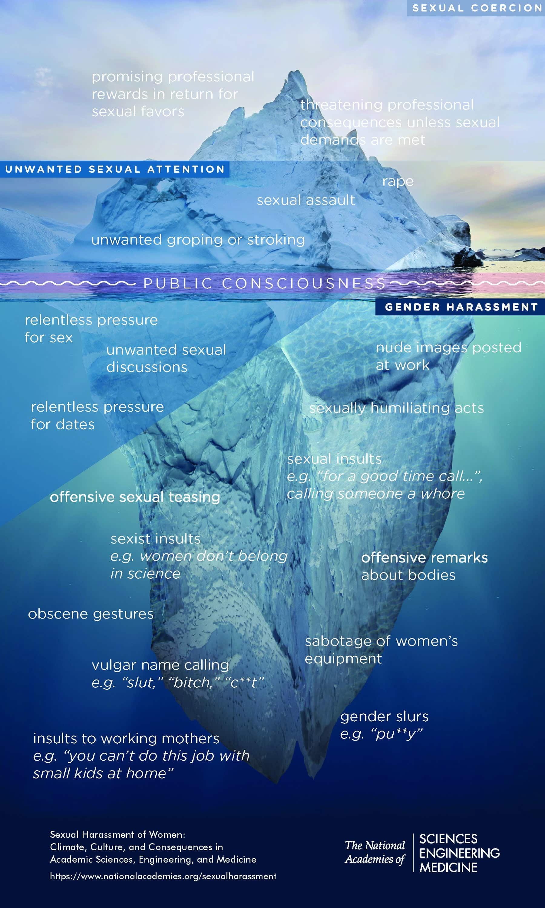
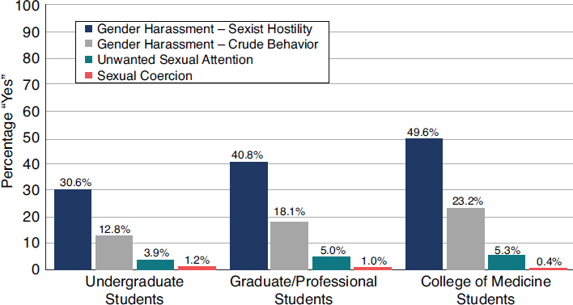
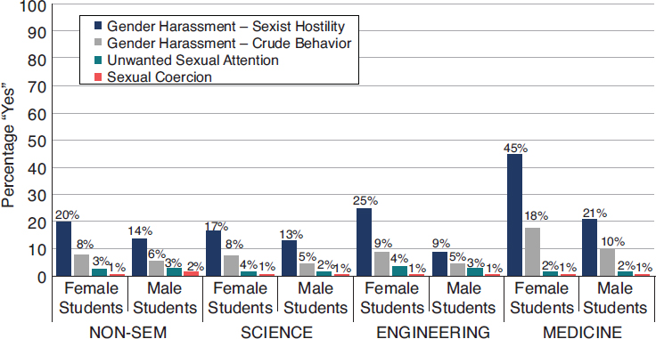

<!> I don't recommend to watch all video listed below! some are of low audio quality and difficult to watch, or have sometimes outdated sources, or an overall approach I don't agree with. This is just part of a project of building both a wide array of references, and extracting a few good recomentations to give out.

Best seen so far: 
 * COMPA videos (French)
 * Preventing Sexual Harassment in Academia
 * Beyond Bias Fair and Inclusive Hiring Strategies for University Search Committees
 * Susanne Täuber - Bullying as a career tool in academia 

## COMPA, série de courte vidéo , prévention VSS harcélemt discrimination à l'université
https://www.youtube.com/@COMPA-IRD/videos

10 vidéos: 2m15+2m23+4m33+5m05+4m09+3m41+8m11+3m25+4m36+2m33 ~40 minutes

1 - définir pour déconstruire - Définit plusieurs termes
violences VSS environnement patriarchale culture du viol  agissements sexistes  sexisme ordinaire  harcélement sexuel corruption sexuel

2- vox pop - doctorantes "il s'approcher trop près de moi, et moi ça me faisait peur" "comment savoir que le consentement est éclairé"
Pouvoir parler, avant/prévention, pendant, après/réparation

3- la pieuvre VSS. pb de tous les endroits où y a trop de pouvoir concentrer sur une personne (eg sport, politique, cinéma, star). Evidemment dans la recherche aussi
   les encadrants ont un pouvoir sur les doctorant. <!> Domination.

   -> il faut généraliser les enquêtes internes
   -> il faut créer des cadres, AVANT, les pb graves.

   -> mais, pour les univs/labos, en parler = mauvaise pub. C'est l'inverse ! ICI, c'est safe.
   
4- Avancer   
    conséquence globale, sur vie pro et vie perso
	honte, culpabilité, peur de pas être cru, peur des représailles
	"survivantes" vs "victimes", pour être dans un mouvement, être victime ne nous définit pas toute notre vie.
	soins : thérapie, être écouter, l'art
	récits de vie: permets de comprendre les méchanismes
	"traumatisme vicariant" = traumatisme des gens qui accompagnent
	le collectif -> analyser ensemble nos pratiques
	avoir conscience de la violence qu'on peut générer ou recevoir
	
5 - vitcime ou témoin, que faire
   porter plainte, accompagnement cellule univ ou assos
   réagir au VSS: sidération, colère, maletre, dénis, peur.
   agir pour soi et pour les autres, ne pas rester seul.
   peurs de se sentir coupable, du regard de l'autre, de pas être cru, de perdre son financement, sa carrière.
   Vous n'êtes pas resonsable
   
   témoin: faire semblant de connaitre la victime. qualifier la situation. accompagner la personne et être à l'écoute. Rassurer, proposer d'appeler un proche.
   
   a faire:
   Briser la loi du silence
   Que les personnes en positions de management interviennent directement
   L'entourage doit prendre conscience de la posture d'allié (soutient, accompagnement, croire)
   Action de prévention, formation et sensibiliations
   
   
6 - le dispositif à Aix Marseille Uni

7- enjeu instituionnel et biais inconscient
  stéréotype : croyance sur des charactérisques propre à X vs Y. (compétences/incompétences souvent)
  biais cognitif : erreurs de perception jugement, via simplification, sur généralisation
  -> test de Stroop: incongruence mot de la couleur/couleur de l'écriture, pour voir la force des automatismes
  
  stéréotype = omniprésent (et la parité ne suffit pas)
  
  reco aux uni: avoir des services de pro à part entière - des gens dédiés à recuillir, traiter 
  reco aux encadrantes/directions: suivr des formations (reconnaitre les pressions), faire suivre des formations
  
  responsabilité de tout le monde.
  l'égalité FH n'est pas du tout établie, sous-représentation dans les filiaires ET position de pouvoir.
  C'est une question politique.
  
  résistance sont fortes. 

8 - enjeu de recherche
    q* de la pratique responsable de la recherche: parle de mauvaise pratique, mais pas des VSS/discrimnations.
	
9 - enjeu mondial : la C-190
    organisation internationdu travail, orga de l'ONU
	convetion 190 définit disrimination et harcélement de manière général, et fait des recommandations, (alors que def <> ds plein de pays)
	
	besoin de recherche. dans le monde 1/5 personnes avec emplois subi violence/harcélement d'ordre physique/psy/sexu, (et femme particulièrement concerné par sexistes). Violences universelles et omniprésente dans le monde.
	                     

10 Voc pop: deesse Ngone
   slam qui résume tout.

##  Preventing Sexual Harassment in Academia (2m10 efficient spot)
https://www.youtube.com/watch?v=21H8YdMCIV8
   what is the problem, what should be done. quick summary of the fundamentals
https://www.nationalacademies.org/our-work/sexual-harassment-in-academia

## Transforming Silence | A Symposium on Sexual Violence in Higher Education at Oxford Uni 
https://www.youtube.com/watch?v=KLstGU-2v0Q 22m55
 
First person presentation, experience feedback from being a victim at oxford, and then attending a symposium to testify at oxford./
Ressources from https://www.transformingsilence.org/resources
https://interactive.aljazeera.com/aje/2021/degrees-of-abuse/index.html

##  Bullying and Harassment in Academia  (18m research like presentation)
https://www.youtube.com/watch?v=ZFhzX1VVd4Q
    defs, bullying \subset Harassment
	within academia, it includes : interference with carrer progress, funding, falsely negative recommendation letters, taking credit for others work, threatening to cancel visa
	
	in essence, a misuse of power. (nice drawing, types of power @julianstodd)
	  people who forget they are in a power position can cause unintential harm. It is not just about being evil.
	  
	can *occasionaly* go in the other way, where a group of students can start gossip.
	
	   * 25% of of faculty self identify as being bullied over a year, 40/50$ have witnessed it
  	   * 1/5 of grad student expeirence bullying   
	   * 57% can't discuss it for feat of personal repercussions,
	   
	       Workplace Bullying, Mobbing and Harassment in Academe: Faculty Experience https://link.springer.com/rwe/10.1007/978-981-10-5154-8_13-1
		   nature 575, 403-403; 2019 (phd survey)
	
   -> https://bulliedacademics.blogspot.com/

   understand the difference being disagreeing, academic debate, academic freedom, criticism, and BULLYING
   
   
   most harassment flowchart advice to speak up.
   if victim: find a support group, talk it through, keep a log, make a formal complaint.
   
   change culture: be an active bystander. (otherwise, it feels like the the audience agrees with whatever is going on
     Responsible bystanders  4D Direct (challenge the behaviour, offer support), Distract (interupt to derail, de escalate), Delegate (seek help from others), Delay (never too late to act, even if we froze at the time)
      
	     [cf aussi https://disbonjoursalepute.com/methode-5-d/]
		 
		 
##  LGBTQIA Student Engagement & Intersectionality in Higher Education (50m research like presentation)
https://www.youtube.com/watch?v=PFxNVa3ub2A

   "Build a culture that is inclusive, affirming, equitable and accessible for all" 
    define DEI (equity requires an understanding of the root causes of dispariteis in society)
    LGBTQ working definitions, glossary
	gender pronous (what is your preferred/chosen pronouns?)
	gender identity <> gender expression <> sexual orientation
	campus ressources -> also need to think about what goes on in the curriculum
	intersectionality: Have you considerer how the intersections of your identities havec impacted your lived experiences?
	 man/white/able people are not aware of their maleness, whiteness,
	++ questions: the part of my identity that I am most aware of on a daily basis is...
	                                                   least
	   rex (hard to pick only one, makes me think of what hurts me)	   
	safe spaces && allies: visible support
	best practices
	don'ts "I didn't mean anything byt it", don't use insults linked to LGBT, deadname, do not "out" someone	   
	intersectionality at the margins (queers & religions, first gen LGBT, ...)     
	benefits
	++ questions: "What is your strategy for improving the experience of LGBTQIA+ students at your uni?"
	              "what campus ressources do you provide LGBTQIA studients that help retain them and creae a sens of belonging at the institution"
				  

## Beyond Bias Fair and Inclusive Hiring Strategies for University Search Committees (19:13m from uni, but ted like)
https://www.youtube.com/watch?v=9IgcGhCYcYY

"small wins" approach
barriers? ~70/80, 5% of musician in orchestra in USA. made the first round blind, women success rates widly went up
bias is an error in judgment -> perceived gender implied a lower estimate of abilities
stereotypes are processing shortcuts
biases are worse under 4 conditions (overwhelemed with information + in a hurry to make decisions + criteria are unclear + no consistent process to guide group decision-making)

-> hiring bias for tenure tracks in psy faculty demonstrated, (Steinpreis, Anders and Ritzke, 1999), Brian Miller 72% succes rate, Karen Miller 44%. Same magnitude of bias independent of gender of personn doing the hiring.
 many similar
-> interstingly, for tenure positions, bigger CV = more info => reduced differences in success rate. BUT still many more doubts for women "I would need to see evidence that she had gotten these grands on her own" "I would need to see teaching evaluation"

Mechanisms leading to bias (gender, but also race, etc):
 Higher bar
 Extra scrutiny

Tools for change:
 
1) create a diverse applicant pool 
    (describe positions broadly in job ads, 
	avoid laundry lists of requirments, 
	beware of narrow searches  -> makes run away people that already not feel super welcome
	
2) Before evaluating, discuss and align on critera before evaluating applicants
                  then, reexamine them, 
question criteria 			  
				  do they contain gender biases?
				  are ones based on style/personnality relevant? -> at US stem faculty, implicit template for hiring faculty was you need to be a forward person, almost agressive. Of course, such behaviour is hugely criticed for people of colour.  				  

move from experiences to skills/competencies  (caring about award implies you inherits biases from the previous jury)
read paper/research statement BEFORE looking at CV

3) screening applicants
   slow down, have a consistent systematic approach to discuss candidates. Consider a rubric
   encourage criteria monitoring to catch new criteria (e.g "Is she moveable?", questions most often asked about women), or disappearing criteria "we have no evidence but it is clear he can teach"
   be alert on bias in recommendation letters, teaching evaluations letters (language in those is different based on gender, psychology: agentic for men, communal (helpful, warm, tactfull) for women, chemistry: more standout adjectives for men, medicine: shorter letters for women with more doubts)
   
4) in one-on-one meetings
   have consisten interview process, to avoid bias
   be alert to whom is being interrupted in job talks. (from several ingeeniring univ, female applicant are more interrupted, and have more follow up questions)
   structur discussions to get input from everyone.
   
   
Case study from stanford 2016: created a rubric with all criterions, evaluation sheet. developed interview questions based on those questions. search chair collected faculty feedback, summarized and reshare it anonymously. Facutly discussion started with the most supportive faculty.    Finished with two diverse proposals.   
     

## Sexual Assault and Harassment - Prevention and Support at UM (45m presentation + 45m panel session at univ masstricht)
https://www.youtube.com/watch?v=CfZESnQDa0E

<!> TW: first part on rape
1) Amnesty international netherlands, report on seuxal violence in the netherlands.
   law on rape in the netherlands not in line with istanbul convention
   rape does not always implies force/violence. Majority of cases=agressor is known. 70% of raped people freeze. police interview focus on violence. Victim blaming. 
   Amnesty campaign "Let's ask for yes". Stop asking victims "Did you say no?", say to perpetrators "Did you ask for yes?".
   30% of students raped at uni keep silent, often out of shame. 60k students in the netherlands carry this burden. 
   bystanders? hard to find the right words. Yet, important to respond in a sensitive way, when people share for the first time (will they share again?)
   11% of female netherland students experience rape, 1% of male, during their time at uni . Don't know where to go.
   68% of male student believe their partner should say no if they don't want to.
   only yes means yes.
   
2) local student activist on the campaign
    scale of the issue -> systemic issue. 2/3 of survivors suffers from long term consequence (socio economics, psychological). 
	Sexual harrassment must not be a part of getting a diploma.
    present manifesto latter
	
3) sexual assault center
   many survivors minimize. "it was just an assaul" "it was misscommunication"
   don't share, try to avoid memories, but have stress.
   share with people that you trust. good options of treatments exists.
   description of a local ressource
   
4) result of a local research study at UM
   Research questions
     how extensive is sexual violence/harassment?
	   ~similar to national results
	   proportion stable w.r.t disciplines
    who are the perpetrators
	   85% male, 61% associated with UM, 70% knew the perpetrator. 
	      aquaintance 40%, romantic 21%, friend 18%, superordinate 1% acamedic 1%
		  
    consequences		  
        73% experience at least one adverse consequence
		  70% personnal consequences
		  30% acadmeic conseuqnces
          6% personnal consequences
		  
    do students know about UM resources?		  
	  93% aware of at least one UM resource
	  52% not at all know where to get help, 27% a little 15 somewhat.
	  70% not at all where to report
	  
	reasons for not contacting a UM resource
	   90% personnal (shame, embarassment...), 30% lack of trust, 20% lack of info 
	   
5) Panel	      
- alcool involved in majority of cases
- mandatory training for faculty? (it is the case in the US)
  sensitive issue, people don't like it. Many form of training already exists, but none on those topics.
  
  uni pres:   would mandatory training help build a culture of consent? or better to start a campaign? 
  center: mandatory training is a short term solution
  student: alcool is not the cause of the rape culture. Important to frame correctly the issues.
  
  tutor need to be trained on their power, what are the boundaries, what is acceptable. We can't hope people will magically discover it.

consent does not come in every days discussion, a training would allow it to come up, be discussed.
  <!> danger in training that makes it worse, just giving litterature or online course, problematic people can stay in their groups and stay negative about it.
  
  <!> teaching consent training does not work, it is a placebo effect.  [Not sure I understand precisely what does not work. REF?]
  
	
	
## Susanne Täuber - Bullying as a career tool in academia (28:34m talk)
https://www.youtube.com/watch?v=9UU11E_SKn8

harrassment and inequality are in a vicious circle
Historical intervention and anti-harassment policy have had little discernible effect over the last 30 years.

focus on bias and stereotypes contributes to ineffectiveness
++ we neglect that some people benefit from all that, and use their power to maintaint everything

bullying: repeated attempt to discredit distabilize and instil fear in target
 subtle acts that erode people confidence
 here, bullying includes harassment discriminations
 
in academia, specific kinds of bullying: refuse promotions, refuse to give tasks needed to get promotions , invisibilisations, labeling as incompetent, financial obstruction

very often, perpetrators are seen as two parts good scientist vs bad person. BUT, perpetrators are perceived as good scientists thanks to being a bad person.
example of uni communication on a perpetrator "[did very bad things] ... But the comitee also found that the acadmeic integrity of this professor is indisputable,  he cannot be stripped of his professorship".

people are saying people can be both great scientists and very bad person.
BUT bullying is a mean for mediocre scientists to rise to the top.
  when mal hierarchies are disrupted by women, it incites hostile behaviours specifically from poorly performing men (because they stand to lose the most).

##  “Hire” Education: Exploring the Role of Unconscious Bias and Search Committee Preparedness  (56m research webinar) by Antoinette M. Boyd, research & HR
https://www.youtube.com/watch?v=xNx6_3LIXGs

Bias in hiring process, affect most culturally.
Steinpreis, Andders, Ritzke, 1999 -> similar qualifications but different gendered names impact decisions in faculty hiring
Wood, Hales, Purdon, Sejersen and Hayllar, 2009 white seen more favorable. (not in academia)

managing bias: recognize, learn more about the group memebres, memory juggers (to stay vigilant), pressure or uncertainty increases bias, uncounscious biases does not mean you are a bad person. (Nichols 2013)

Common errors in hiring: judge personal factors/identity > qualification, job descriptions without clear objectives and not inclusive, untrained committes with poor structure

Litterature review:
higher education reflect broader society issues.
students often cite concerns with faculty/staff diversity to improve
student demographics becomes increasingly diverse, but not faculty -> 16% of professors are minorities, most confined to historically black colleges and universties.
role of search committes often overlooked
uncounscious bias makes us favour our group. Uncounscias bias affect evrything, strategy policies procedures. Makes people feel exclueded.

Schneider (1987) framework "The people make the place"

results from a qualitative study over nine participants deans, and HR. 

Current hiring practices: sometimes focus factors not related to ability to perform. different standards for different people.
search  committe composition: too homogenous -> candidate not ill at ease.
the "fit" factor -> in an homogenous committe, somebody asks whether "the personne vould be a good fit", which actually means is the person gonna be just like us. very common
Effects of bias: can guide the decisions making. implies hyper scrutinity of women's candidates credentials.
improving hiring process: do a self evaluation as institution. 

Recommendations: greater involvment from HR professionals who know best practices, behavior modification training focused on overcomming individual bias in committes shift the focus to clear and timely positition description, increased transparency and better strcuture for assembling search commites, develop a well-constructed recruitment and selection process.

take action: ban the "fit"world. use inclusivie language. create processes, for building sea4rch commites, include hr experet on each search committe, implement annual bias training for employes on committes, include a diverse group of students in the hiring process, use anonymization when possible, in-depth assement of current hiring practices, train people who can train committe members, have 3-5 clear priorities for each committe

the goal of hiring is not to find friends.

##  Hiring Diverse Faculty: Promising Practice  (very bad audio)
https://www.youtube.com/watch?v=xxFzTicy__o

Why diversity?   (<!> some old sources, not clearly decisive, e.g. Van Harstesveldt & Giordan is discussion during a workshop)
Enriches teaching and learning environment for ALL students, Piercy et al 2005; Milem 2003; Hurtado, Milem, Clayton-Perderson & Allen, 1998
higher quality research outcomes Van Hartesveldt & Giordan, 2008; Milem, 2001)
Aids retention of minority faculty O'Mear, Lounder & Campbell 2014, Price et al, 2005

In health/biomedical science fields, reduces health disparities and bias in clinical tirals. Ford et al 2008; Noah, 2003; Whitla et al, 2003
++ Higher journal impact factor and number of citations if co-authors are ethnically diverse. (Campbell, Mehtani, Dozier & Rinehart, 2013 ( https://journals.plos.org/plosone/article?id=10.1371/journal.pone.0079147, empircal study) ; -- Freemman & Huand, 2014 (https://www.nature.com/articles/513305a, just a "reflection"))

include diversity advocates on committes

invite applicatans to submit a diversity statement describing their past contributions to diversity?
 (Columbia universtity 2017; UC Irvine, 2016, UC San Diego 2010)

##  Identifying & Reducing Potential Sources of Bias in Promotion & Tenure Process of University Faculty  (50m
https://www.youtube.com/watch?v=4vbvejnRWvs

Four illustrations of tenure track denials, with often, let's say surprising decisions and reports (e.g. errors on citation count or impact factor journals, or denied based on probably mysoginist reports from students)

In all cases, candidates perceived bias in the situation.
 * bias on disciplines, on distinct publishing norms, bias in assessing an individual scholaor contributions tot ocllaborative project, bias in student evaluations
 
 https://www.chronicle.com/article/promotion-rejected-your-record-may-not-be-the-problem
 https://www.academia.edu/126946386/Promotion_Rejected_Your_Record_May_Not_Be_the_Problem
study of 2000 promotions in 10 universities:  women and faculty of color are much less likely to receive unanimously positive promotion votes.
 
 potiential source of bias: external review letters, committe composition, metrics for evaulating teaching/students evalutions of teaching, metrics for eavaluating reserach (citation counts, journal impact factir)
 
 issues when recruiting criterations are not shared evenly
 
 best practice for external reviewers (not free of bias, aura effec from high profile scholars, refusing to give a letter may come from many reasons, do not let a single "doubt" raiser decide the case.
 
 best practice on committe -> a single toxic faculty member can ruin everything (especially if senior).
 
 student evaluation:
   * both make and female student rate female instructors lower (Mengel et al 2019)
   * even if study is online and gender is a lie  (MacNell et al 2015)
   * women are 11%  less likely to make the cutoff at some uni (Wagner et al 2016)
   * Reid 2010 and Aruguete et al (2017), faculty from underrepresented racial groups rated more negatively than white
   * Smith and hawkins 2011, lowest result for black faculty
   * wang and gonzales (2022), white professor receives best student evaluation, even when controling for course difficulty
   
   
Bias in scholarly metrics

Many study suggest that journal impact factor and publication indices can be problematic (Conroy 2020; Hirsch 2005; McKiernan et al 2019; Moher et al 2018; Zare 2012)

Zare 2012 "Some rough correlations do exist, but juding researchers early in their careerm the H index seems to be a poor measure"

## Forum 55 | Dr. Frazier Benya | Sexual Harassment within Higher Education (50m prez + 30m questions)
https://www.youtube.com/watch?v=4exZre_0zlU

start at ~8m30

on the report of  https://nap.nationalacademies.org/catalog/24994/sexual-harassment-of-women-climate-culture-and-consequences-in-academic

consensus report on sexual harassment in higher education (science engineering medicine)
  prevalence?, impact on recruitment?, successful practices?
  
  Summary: extensive sexual harassment, gender harassment is most common. It undermins research integrity, reduces the talent pool, harms target and bystanders. Legal compliance is necessary but not sufficient. Changing climate and culture can prevent and adress it.

sexual harassment (sexual coercion, unwanted sexual attention, gender harassment=putdown, hostility,)

Iceberg image with public consciouness (but no a clear hierarchy of consequences): 

report highlights https://nap.nationalacademies.org/resource/24994/Sexual%20Harassment%20of%20Women%20ReportHighlights.pdf

best analsis to date: 50% of women faculty experience sexual harassment
20-50% of students experience SH from faculty.

even the "small" harassment is harmful.

most targets just want to be able to go back to work, not go inside a complicated procedure. they are unlikely to report it.
We must adress the system, and not just have ideas of legalize and training on the most obvious things.

sexual harassment is most likely to take place in male dominated in number, leaders and culture, and where there is organizational tolerance of sexual harassment (reporting is perceived as risky, reports not taken seriously, offenders escape sanction)

                   
Recommendations:
  1) create diverse inclusive and respectful environments
      take explicit actions for hiring, promote civility (in the social science sense), develop skills to interrupt and intervene (<!> backslash), training that aims to change behavior, not beliefs.
  2) diffuse the hierarchichal and dependant relationship between traines and faculty
     mentoring networks + independent research funding (attached to the trainee,  not PI)
  3) provide support for targets
    access to support services without the need of fomal report, alternative informal reporting, prevent retaliation
  4) improve transparency and accountability
    develop clear accessible polices, standard of behaviour. transparency about handling reports, assess climate
  5) strive for strong and diverse leadership

action collaborative, joint university group to work together and avoid reinventing the wheel.
Many actions taken, e,g, cross reference check applicants, shift from mandatory reporting to mandatory suporting, restorative/transformative justice, 360 degress reviews of faculty, evaluate mentors for graduate students, easing switching advisors.

https://www.nationalacademies.org/our-work/action-collaborative-on-preventing-sexual-harassment-in-higher-education/resources

environments can create sexual harassment (even from people who did not have strong bad beliefs), see 2018 reports, chapter impact

anonymous sytem: https://www.projectcallisto.org/
interest of standardized systems (sometimes, old report are lost, and people reput into position of responsabilities)

## Sexual Harassment in Sciences (from 6m to 22m, summary of the same report as previous video, by different person) 
https://www.youtube.com/watch?v=wy7aDhm4AcI

gender harassment, "conduct that convey hostility, exclusion or second class status about women" contempt
consider law as a floor, not a ceiling
even when sexual harassment entails nothing but sexist insult, it takes a toll. in fact frequent and pervasive gender harassment does the same professional domage as sexual coercion.

Figure 3-2 from report 
Faculty/staff-on-student sexual harassment incidence rates for female students by type/level of student and by type of sexual harassment (Penn State University).
NOTE: The survey was given to 11,023 undergraduate students (2,945 responses), 4,000 graduate/professional (law) students (1,637 responses) at the University Park campus, and to 889 medical and graduate school students in the College of Medicine at the Hershey campus (411 responses).
National Academies of Sciences, Engineering, and Medicine. 2018. Sexual Harassment of Women: Climate, Culture, and Consequences in Academic Sciences, Engineering, and Medicine. Washington, DC: The National Academies Press. https://doi.org/10.17226/24994.

 Faculty/staff-on-student sexual harassment incidence rates for female students, by type of sexual harassment (University of Texas System).
National Academies of Sciences, Engineering, and Medicine. 2018. Sexual Harassment of Women: Climate, Culture, and Consequences in Academic Sciences, Engineering, and Medicine. Washington, DC: The National Academies Press. https://doi.org/10.17226/24994.

<!> All worsened when LGBT or non-white woman.

In europe, see -> https://unisafe-gbv.eu/wp-content/uploads/2022/11/UniSAFE-press-release_survey-results_FR.pdf

https://observatoire-vss.com/wp-content/uploads/2023/04/Dossier-de-presse-Barometre-2023-des-violences-sexistes-et-sexuelles-dans-lEnseignement-superieur-1.pdf

many intervention assume that it is safe and useful to do report -> IT IS NOT THE CASE
go beyond law

  star culture? interrupt speakers to show your own value?
  
  
panel  

we tend to think about sicence as objective. But science are not. And we don't eflect 
competition, agression, upmanship, macho behaviours (testing bejaviour to see if you can thrive within the competition)

Quotations - Appendix C from report:

-> quote on normalization
I would tell [friends] outside this profession who would be like, “Are you kid-
ding me, what?” But the people who work for this institution were like, “Can’t
you just suck it up? This is not going to go well for you if you report. You don’t
want to make a fuss.” I knew they were right, but at the same time, I really was
like, “This is just too much. I shouldn’t have to be preparing to get raped when
I go into work.” (Nontenure-track faculty member in medicine)

-> quote on the importance of support group:
I happen to be in a department that is well above the national average for women
faculty in [predominantly male fi ld]. Because of that, we have a really strong
network of women who—I mean, we go out to coffee once a month just to talk
about being female faculty from the full professor level all the way down to
fi st-year assistant professors or instructors. Because of that, it’s easier to face
some of these issues when you kind of have a team behind you. I know I’m
lucky in having that kind of network here; most women faculty don’t. (Assistant
professor of engineering)

sometimes, we believe that data is more important than the people who produce it...

Consequence of harassment:
Prior to the event I had hoped to be a number one scientist and go for a tenure
professor position, or main research scientist, whereas now that is not in my
scope. . . . So, I feel like I have refocused to more menial roles, perhaps staying
as assistant research scientist as I have been doing, and now not stretching for
anything greater. (Nontenure-track faculty member in geosciences)

harassment change relation to work and science. 
The way we conduct our science is leading to the best science, or do we get impoverished science, because of the way we enable this behaviour

need to change award system (nobel price to 3 people, for a thousand people who discovered gravity thingy)

harassment IS scioentific miss conduct.

appendix C, interviews from qualitative study is very powerful

++ story in a lab: a man was superly bragging "look at how many women I got into the lab" WTF, women don't belong, and they are here thanks to you? you want a cookie for that?

++ when you take the time to see how gender harassments stems from misogeny, and see the harm it causes to everybody. Until you gave this talk, I did not have a name for what I was living. 

we can't just have a checklist of todos to take to the dean, we need people pushing for this. 

bystandard intervention: many steps, be able to identify the behaviour, be able to interpret it is a problem, decide to intervene, take responsability, the act.
there are witness for most gender harassment

in hiring, we don't really need to have a tool to check if people are willing to participate in a building a good culture. We sometimes already know, but the quality of the scientific work overwrite this.
  clarify the rules for hiring! OoO take inspiration from questions from CAPES for MCF interviews? 
  
how to shutdown a conversation? Natural response, to hide. Learn ways to press conversation. People in power position can force discussions on this.

BIG shift, don't wait for people to come forward. we are delegating responsability to the law. We must take responsability, indivudally, collectively.

pb: affraid of losing recommendations letters, pb bystander vulnerability

focus on graduate students
to graduate students: reminders, unions were the first organizations to develop harassment issues reporting. Think about the organization of your work. There are things you can do because you are still part of the power structure.

##  Dénoncer ou ne pas dénoncer les violences sexuelles en milieu universitaire ?  (44m10, chair VSS MES, Ihssane Fethi, candidate au Ph.D. en psychologie à l'Université de Montréal, Manon Bergeron, Sexologue et professeure à l'UQAM)
https://www.youtube.com/watch?v=dfFfHAlv8O8

ESSIMU: grosse enquête en 2016 sur les VSS, 6 uni Quebéquois, >9000 réponses.
https://constellation.uqac.ca/id/eprint/4098/1/Rapport_ESSIMU_FINAL.pdf

2000 récits de victime. 230 mentionne la notion de signalement (non) dénonciation. 33 exclus car trop court, ou signalement exterieur à la police.

197 corpus, 55% signal, 45% non signal. (sur 2000, **90% de non dénonciation**)
            86% femmes. 
            21% 1er cycle, 29% deuxième/troisième cycle, 21% prof, 24% employé.
            Moins de signalements dans le 1er cycle/chez les plus jeunes. 

Motifs de signalement: 
1) mettre fin au comportement 
2) peur, malaise extremene, menace 
3) incitation de l'entourage 
4) prise de conscience de l'experience de victimisation

Non-signalement:
1) crainte de récpercussion négatives
   sociales "craintes de rumeurs, de jugements"
   professionelle, perdre mon emploi
   parcours académique "peur d'échouer à un cours"
   peur des conséquences pour l'agresseur "je ne voulais pas lui nuire"
   peur de représailles physiques "j'avais peur qu'il s'en prenne à moi"
2) recours à des stratégies de défense et de mode de protection
   stratégie d'évitement
   confrontation/menace de dénoncer "je l'ai menacé de porter plaine pour qu'il arrête"
   
3) croyance que les gestes sont pas suffisament grave
   "ce n'était pas du harcélement grave"   "une situation grise"
   "c'était anecdotique, banal, bénin, ordinaire"
   "ça n'est arrivé qu'une fois, je n'allais plus jamais le revoir"

4) perception négative de la réponse institutionnel
   la necessité d'avoir des preuves "c'était parole contre parole"
   manque d'impartialité et de fiabilité "j'ai entendu des histoires d'horreur sur le traitement des plaintes d'agessions sexuelles"
   manque d'information "à qui signaler à l'université ?"   
   compliqué et exigeantes 
   

-> les rapports de pouvoir ajoutent des obstacles à la dénonciation (jeunes, statuts + précaire)
-> enjeux indiv et collectif : tension entre la préservation de soi et la prévention d'autres situations
-> ne pas dénoncer, c'est aussi prendre action (ne pas sur estimer la valeur de la dénonciaiton, vs sécurité physique, émotionelle, cadémique)
-> normalisation des violences sexuelles (influence de la culture du viol)

ccl, très important de rendre les informations disponibles, apporter plus de transparences. Centrer les efforts sur les personnes victimes.

##  Harcèlement sexuel et doctorat avec le CLASCHES (56m18, podcast, 2021)
https://www.youtube.com/watch?v=rM-hXQD4ZmA

CLASCHES - Collectif de Lutte contre le harcélement sexuel dans l'enseignement supérieur - since 2002...

diffusion d'infos, playdoyé, formation, orientation/accompagnement des victimes (non juridique)

- Def légal harcélement sexuel - code pénal + code du travail + statut des fonctionnaires.
Loi 2012, avec une def basée sur le ressenti de la victime. (et pas sur l'intention, un agresseur peut pas dire "ah mais c'est pas ce que j'avais en tête)
y faut au moins deux faits, sans limite de temps
impact sur conditions de vie ou de travail
inclu aussi le chantage sexuel, même avec un unique fait

les blaques lourdes (sur le physique, la tenue, ) sont du harcélement. à partir du moment où une personne se sent mal à cause de propos, même indirect/globaux.

- spécificité de l'ESR
La culture ne fait pas échapper magiquement au patriarcat. Une évolution grace à des enquêtes dans la presse ou des campagnes sur les réseaux.
Faible nombre d'étude précise et d'ampleur national.
Après 20 ans de clashes, y a pas d'établissement qui y échappe.
Position de pouvoir maj homme, proportion de fenne diminue dans la hiérarchie
Fort réseau de connaissance, effet de corporatisme, rendant difficle la dénonciation ou le soutien au victime
peur de pas être suivi par l'institution

enseignant jugé que par leur pair, pas d'étudiant
relation spécifique direction de thèse, privilégié, sur le long terme, rdv souvent individuel, (+ en science humaine petite univ sans bureau), asymmétrie de pouvoir (pas de soutien pour publication, ou recommendation, ou envoi conférence, pas intégré dans la sociabilité du labo, pas intégrer dans tel projet), potentiel d'admiration
Asymmétrie de pouvoir entre homme blanc bien installé et pŕecaire qui font tourner la machine, souvent des femmes.

relation de domination et pouvoir

- évolution de leur prise en compte
pas évolution clair, très variable selon discipline/établissement. 
Les demandes viennent le plus de SHS, peu de STEM.
Tournant avec MeeToo, qui a aussi augmenté les témoignages reçu par l'asso
affaires récentes, SciencePorc, université et ministere forcé à agir.
Amélioration législative, chargé de mission égalité devenu obligatoire depuis qq années, cellule de vieille obligatoire depuis 2020. 
Mais quelles moyens et quelles ambitions pour ces dispositifs ? 

Dans plein d'etab, il y a encore l'envie de préserver l'image, de "l'excellence", et donc intérêt de faire taire les victimes, ou à ne pas publier les résultats des affaires.
Recours à l'enquete administrative permet de faire jouer la montre, et de pouvoir faire disparaitre le problème via une enquete opaque, et pour éviter la saisine du conseil disciplinaire.
Même si procédure abouti avec sanction, on a tendance à minimiser les aspects sexuels du harcélements.

clasches gère plein de cas différents, etudiant/étudiante, enseignant/enseignante, direction/thésarde.
Agresseur qui souvent mète en avant une impression de malêtre et se confie, pour donner l'impression à la cible qu'elle est privilégié/intimité.
Agresseur travail à isoler les victimes, faut pas trop en parler autour.
Insidieux.
Fort risque de représailles si la victime refuse/veut mettre fin à la relation. 

- quelques conseils, pour les victimes ou témoins

Pour agir, on demande et respecte toujours ce que veulent les victimes. Beaucoup disent, là je veux rien faire, je veux finir mes études.

écrire des récits circonstancié, reprendre tous les évènements, dès le début où tout était normal. Aide à comprendre où ça a basculé. 
 déjà une forme de preuve, avec description précise des faits et des conséquences. SMS, journal d'appel, mails. Certificat médicale sur état de la personne aussi preuve
 possibilité de faire appel à des témoins, à la fois sur les situations d'agressions, mais aussi sur la dégradation de la santé des personnes.
 
 se protéger, s'écouter. Reconnaitre que la situation est pas normale. Essayer de ne plus se retrouver seule avec l'agresseur.  Accepter de demander un arrêt de travail si nécessaire. Rassembler les pièces pouvant potentiellement mener à des procédures, même si on veut pas forcément le faire de suite. Rompre l'isolement dans lequel la situation nous a surement plongé.
 

Responsabilité collective de surveiller cela, rôle du comité de suivi, si une personne avance plus dans sa recherche, a pris ou perdu beaucoup de poids. Créer du lien, entre doctorantes, ou à l'échelle du labo. 
Pour les témoins indirect: 1) croire la victime, pour redonner du soutien et pour créer un environnement  2) ne pas remettre en question les paroles et le ressenti de la victime ("t'es sûr que", "je trouve ça fou que...", "mais il est si gentils", ...) car c'est remettre la victime dans une position de doute 3) être là, selon ce que la personne souhaite faire et en respectant son accord (sinon, on la dépossède encore de son vécu, de sa liberté d'action), 
témoins directs: ne pas se mettre en danger, venir en soutien de la cible, interrompre l'interaction de un à un, ne pas mettre la victime en difficulté (elle pourrait subir les représailles de votre intervention)

- bilans des sanctions mitigés contre agresseurs

exemples de deux dernier cas intéressant:
Univ Paris est Créteil, sanction de trois ans sans enseignements, il en a profité pour trouver un poste ailleurs, la sanction efface la portion VSS. Sanction importante par rapport à d'habitude, mais au final, il en profite presque.
Lyon 2, sanction au niveau de l'uni, appel au CNESER qui a annulé la sanction, situation de harcélement sexuel avec de nombreuses preuves dont enregistrement téléphonique.

Trouver des exemples de sanctions est pas si évident -> procédure très longue, avec appel, déqualification des faits et invisibilisation de la part de harcélement sexuel, et le cneser casse souvent les décisions e.g. sur des vis de procédures (car dossier parfois mené par des gens non suffisament formés ou pas avec assez de temps).

- comment faire bouger les lignes

sans trop se mouiller, écrire à clashes pour demander du matos de com' (affiche stickers guide)

inviter clashes à faire des formations (facturé selon les lieux), adapté aux public cible

reco ressources : docu "The Hunting Ground" (terrain de chasse), université américaine

##  Prof Celeste Kidd speaks on How Sexual Harassment Creates Inequality in Academia (academic lke presentation, 1h18m, 2019)
https://www.youtube.com/watch?v=leQ2SlkASbg

Intro by Senator Ivana Bacik:

suvery from univ in Ireland, 11% of students reveice unwanted sexual contact, 5% survivors of rape.

https://www.sfi.ie/research-news/news/irish-funding-bodies-to-require-athena-swan-gender-equality-accreditation-for-higher-education-institutions/
In Ireland, Science Foundation Ireland, the Irish Research Council and the Health Research Board will Require Higher Education Institutions to Have Athena SWAN Gender Equality Accreditation in Order to be Eligible for Research Funding.
-- bronze levels require climate survey
as everywhere else, SH underreported
most prevalent kind of SH might not be criminalizable, but it is still a very big point of focus.

any relection must focus on intersectionnality and power relations. Those in power have more opportunties to harass.

Chairing by Clare Kelly. Celeste Kidd, whistleblower and harassment survivor University or Rochester

17m42 Celest Kidd state

SH = gender harassment + unwanted sexual attention + sexual coercion
From university Rochester, filed with 8 other faculty (who all left the uni because of this) a lawsuit for the university misshandling harassment case
Celeste lived through as a graduate student unrelenting and demoralizing sexual harrassment  from a professor  Florian Jaeger, still employed by university. -> https://academic-sexual-misconduct-database.org/person/t-florian-jaeger
The professor, based on the official inquiry of the university:
	talked about his lust for some students, + calling them dumbs.
	sent dickpicked, 4 sexual relationships with students
	mentored and wrote  recommandation for a student while having sex
	
non exhaustive list, use threats to keep silent, and sometimes did destroy reputation

"Harassment is targeted at those who lack the power to stop it" NASEM report 2018, Clancy, Nelson, Rutherford  & Hind, PLOS ONE, 2014

fieldwork increase risk, and trainees are the most widly targeted
Worst place is medicine (NASEM)

Celeste personal solution: drop all projects with Florian, and was able completely changed subject (a luxury many people don't have). 

Says she was very lucky to be able to change field like that.

US EEOC (equal employement opportunity commision) report on workplace harassment, 2016 -> reporting SHtriggers retaliation 75% of the time.  
  - probably worse in academia because of more opportunities to destroy the carreer of somebody compared to companies (a professor can ban you from all universities)
  
Professors controls what trainees work on, where, who gets credits for the workm who get access to expensive lab equipment/grant money. Professors entirely and anonymously control if a student gets their degree. Word of mouth carries a lot of weight. Established professors can even control  who gets job or grants.
Anonymous feedback from professors makes it easier to retaliate, and victims can't even know it is happening ... !!!

The less powerful the victim, the stronger the retaliation.

Lack of data in academia, but newspaper journey are worrysome -> dramatic need for more reserach

University investagtions have bias toward finding nothing (otherwise, they have legal liability)

 - Rochester univ  called Florian comments "colorfull" instead of SH, did not accept to hear some witnesses or victims, did not look at some mails and other. "Why would you assume the accused would lie?"
 
 External  firms have the same issue, who would pay a firm a lot of money to create a liability

Faced with eleven women making complaints, university first reflex was to mention a single false accusation story (which was at first an anonymous online report, and had nothing to do with the situation https://en.wikipedia.org/wiki/A_Rape_on_Campus)

Then, investigation confirm a lot of the claims. So, change of tactic, now say that such behaviours were not SH.
 UR statement: "We cannot unravel the degree to which women avoided Jaeger because of the sexual elements in his conduct,as opposed to other simply offensive or unappealing aspects of his personality"
 UR promoted Florian Jaeger in the middle of the first investigation
 
 UR Investigation deanonymized unwilling complainers
 
 
 More generally, Celeste Kidd heard many testimonies of undergruate student that were crushed and betrayed by uni investigators.  The systems are not there to protect people, but to protect the uni from prosecutions. e.g. "Case dismissed because a classmate defined her as a slute"
 
 Schneider, Swan & Fitzgerald, J of Applied Pshy, 1997 - 2 out of 3 women faculty experience SH
 
 Cascading effects beyond victims, we lose valuable contributions.
 
 SH causes women and minorities leave domains where they are already under represented.
 
 What do we do ?
 
  - we are missing a lot of data, so we need to try some things, collect more data, iterate
  
1. People who report need support
   Need for allies in faculty

2. People who report need options for how and when   
   not always possible to come forward right away (need to protect oneselves first)
   side comment, many cases have in fact a lot of evidence (email, text messages), so there are not that many "he said, she said" things.

3. Institutions can't police themselves
   they face a conflict of interest!
   mechanisms need to provide powerless with actual independent investigations options
   

4. Entities without liability and Conflict Of Interst issues need to step up
   e.g  funding bodies, publishers, ...

5. Power abusers need to lose that power

6. We need to keep talking.
  things have been horrible for a long time, but all people did not know it. 
    
  

To conclude, many examples of student protests at UR, that recognized their own stories in Celeste Kidd and the other stories.

55m -> Chair and questions

- SH harassment is invisible unless you experience it, it can be unbelievable sometimes that such things did occur. How can we adress to reduce this overall scepticism?

	+ estimated rates of false reports are around 5% (though it is a mess of science https://en.wikipedia.org/wiki/False_accusation_of_rape)
   report processes are hard and in fact risky, most report come with evidence.
    + many men were truthfully not aware of the scale of the issue before the MeToo thing.
      there is good data available now
	  We can speak about it now in public forums. 

- talking about it can put pressure on victims. How did you find the courage to talk about it?
  + I would have liked not to bring it to light, and not to relive the trauma. But, it was clear it was not an isolated story, need to talk to support others.   For her first complaint, she was told her name would be kept secret, then the uni outed here (as a mechanism to threaten others). I would love to be courageous. I was not courageous, the uni outed me...
  
- a lot people think that such behaviours are normal, and if you want to stay in academia, you have to put your heads down. What do you think on this?
 + Yes, but Celeste stories also illustrate it is not normal. And it is not. we don't talk enough about the top down duty of employers to protect workers.
 + Many colleagues tell me, I'm happy you survived. But all women should have equal oppportunities to make it out
 
- would you encourage women to speak out about more subtle issues than SH ?
 + we need more research to understand such problems. And everybody can be an ally, important to make your stance clear on this.

 
##  Violence sexuelle en milieu d’enseignement supérieur et diversité sexuelle et de genre  (55m38 Geneviève Paquette, P.h.D., 2020)
https://www.youtube.com/watch?v=yVsDDRV2JYY

https://www.couragetoact.ca/
https://possibilityseeds.ca/experiential-learning-project/

Canada -> violence sur le genre aussi outils de colonisation
Rappel attention malêtre pendant la conférence.

1. Intro
2. Def Violence sexuel "acte sexuel commis par une personne envers une autre sans le consentement libre et éclairé ...".  similar to SH\
  minorités de genre "pers s'idnetifiant à un genre qui ne correspond par à celui qui leur a été assigné à la naissance".
  minorités sexuel "personnes avec orientation sexuel diff d'hétéro"
  
3.  Enjeu LGBTQ+ en matière de VS dans l'enseignement supérieur

  + prévalence de VS + élevé, populations significativement plus à risques.
  
  exemples de récits.
  
  pourquoi plus ciblé ? 
  théorie féministe
    -> la fonction de la VS est d'établir et de maintenir les rapports de pouvoir en regard du genre, de l'expression de genre et du comportement sexuel.
	-> moins on a de pouvoir plus on est à risque
	-> les hommes sont plus souvents auteurs et les femmes vitcitmes
   
 théorie objectification sexuelle
   objectification: la valeur d'une personne est réduite à son utilié pour les autres
   sexualisation : réduite à ses comportements sexuels.
      pers issu de minorité sexuelle/de genre sont plus objectivé
  
  + conséquence plus grave, + de PTSD et + dépression, - d'estime de soi.
  
  
  les réactions des personnes confidente pas toujours aidante. Pourtant, large consensus, les reáctions influe les conséquences, dont PTSD (constation sans soutien, et accusation/exclusion augment PTSTD, et aussi surprenament les réactions positives "m'ont fournit de línformation et ont discuté des options avec moi" sont associé à plus de PTSD que juste celle qui offrent strictement du réconfort.
  
  comment expliquer les conséquences ? 
  théorie du stress minoritaire: être minoritaite => + de victimisation, + d'observation de la victimisation, interiorisation des discriminsations, + anticipation de la victimisation => conséquence négative sur la santé mentale
  
  théorie de la médiation psychologique: 
  modèle de sensibilité au rejet: plus on est exposé tôt au rejet, plus on va y devenir sensible.
    peu expliquer pq réaction dáidant qui pousse à láction peut augmeneter le PTSD, car les personnes pourraient anticipé les difficultés dans les étapes futurs
  
    
4. enjeu relativ à láccompagnement des victimes + préventation

  + pb du double/triple outings pendant le processuus d'aide -> en plus de devoir révélé la VS, doit aussi révélé être dans une/des minorités -> moins de plaintes pur les minorités.
  + trahison instituionnel
  + acceptation plus grand à cause d'une vie marqué par la discrimination. Forte tendance à banaliser, expliquer ou excuser la VS, par exemple sous lángle les gens connaissent pas bien, sont pas vraiment méchant. 

 + service peu adaptés aux réalités LGBTQ+, organismes de lutte contre VS plutot dévelopé dans le contexte classique :  prévention qui table trop souvent sur le modèle classique de l'homme cisgenre hétéro qui agresse la femme cisgenre hétéro 
 + prévention aussi peu adapté car communauté élargie, e.g. en STEM, adhère a l'hétérosexisme et au cisgenrisme. (il faut expliquer ce que c'est que d'être queer, ou bisexuel)
 
 
5. recension pratiques existantes au quebec
sur les questions spécifiques LGBTQ+
    prévention et sensibiliation  26/33 univs  (33 = la moitié des milieux univ)
	action concrète pour env inclusif (e.g. toilette, utilisation du  prénom choisi) 22/33
	éducation de la population en milieu académique 18/33
    groupe de soutien dans 16/33 univs 
	formation des interventaes et intervenants spécialisé sur les plans VS ET LGTBQ  9/33
	programmes ou interventions pour les victimes 4/33
	
	
	
6. recommentations pratiques	

  utilisation de matériel pedago avec   langage épicène et images inclusifs
  accès à des services psychosociaux internes et externes adaptés à la div sex/genre
  
  impliquer et former tous les membres (etud, ens, BIATSS) de la communauté de l'établissement	
  bystander training
   

   mise en place d'une approche d'intervention sensible au trama (e.g la personne présente probablement déjà des traumas passés, dans le doute, on en prend compte)

	examples de prorgamme: 
	Know your power ->  campagne de sensibilisation, avec images inclusives.  Efficacité démontré sur la sensibilisation et le bystander action
	
	
	ThinkLuv: formation de 30 minutes sur la prév VS, mais adapté au caractéristiques des personnes. Juste prometteur.
	
	(BERA) Bonifé évalié reconnaitre agir, 12h formation en petit groupe ciblant les nouvelles étudiantes au 1er cycleu universitaire. Vise à augmenter le pouvoir dágir. Diminue le risque de subir un viol ou autre VS dans la 1 ere anné d'étude
	
	plateforme ALIX, soutien spécialisé, permet de dénoncer de manière anonyme
	
Conc: stigma spécitifuqes, 	qui doit être pris en compte dans toutes les actions de prév/intervention

Q: comment intervenir?
on peut commencer sur les trucs pratiques et simples:
* ne pas avoir accès à des toilette non géré crée des pbs pour les minorités.
* Pareille sur l'utilisation des pronoms, c'est bien de déclarer ses pronoms, pour rompre le cisgenre centrisme

Q: pour se former, quelles ressources ?
le mieux c'les organismes qui interviennent dans les milieux concernées. Victimes sont notamment plus à l'aise pour leur parler (pas besoin d'expliquer milles trucs)

q: faut-il plus intégrer dans les pres existantes les aspects LGBTQ+, ou crée des formations ciblés ?

il faut faire les deux, de la prévention universelle qui parle des réalités des communautés LGBTQ+, mais également de la prévention ciblé, e.g. groupe de soutien (cf BERA).

## Isabelle Vauglin Egalité femme / homme dans l'Enseignement Supérieur et la Recherche : a-t-on vraiment évolué ?
https://www.canal-u.tv/chaines/inria/egalite-femme-homme-dans-l-enseignement-superieur-et-la-recherche-a-t-on-vraiment

bilan social CNRS 2021, fier d'annoncer 43% de femme, mais permanent.es 34.4% et doctorant.es 36,4%. 
Femmes + présentes dans les rangs les plus bas. (61% des C vs 34,3% des A+)
split par domaine, technique vs gestion
-> inégalité de salaire partout, e.g. 4,7% pour H dans les chercheurs
Temps partiel toujours plus de femmes

(cf prez de Laurence Broze)
Prof section 26, parité atteinte en 2270, et en section 25, plus de femmes prof en section 25
section 25, la période de bosse de recrutement (1996 à 2006) a favorisé que aux hommes

En astro, confirmation de tous les points précédents (+, + de F en postes temporaires) (55% des chercheuses sont permanentes, vs 66% des chercheurs)

Question de volonté :  https://www.nature.com/articles/s41550-023-02079-6 "The achievement of gender parity in a large astrophysics research centre"
Entre 2017 et 2022, le centre Astro3d a atteint la parité, de 38% à 50%

Mesures: 
- objectifs claires en matière de diversité
- selection d'un ensemble diversifié de cheff.es d'équipes
- une formation (2j) sur la diversité pour les jury pour tlm, tous les ans
- garantir 50% de femmes dans les comités de selection post-doc
- garantir 50% de femmes sur les listes restreintes de recrutement post-doc

Effet cascades (+ de femme leader -> + de femme postdoc -> + de femme PhD), 

Il faut recruter ET garder -> les femmes restent plus dans des équipes dirigés par des femmes

Mesures:
- implicit bias training, members also took cultural, LGBTQIA+, and Indigenous awareness training in subsequent annual retreats, and held monthly seminars on diversity and inclusion
-  The center’s code of conduct clearly established actions against sexism, insults, microaggressions, and behaviors that excluded other members, and the center had multiple ways of filing misconduct complaints.

Des espoirs?

sondage france info 12/01/23~:
- de moins en moins de jeunes (18-24 ans) pensent que la science apportent plus de bien que de mal (55% en 72, 33% en 2023)
- 19% des jeunes pensent que les pyramides viennent des pyramides

2022 - les filles réussisent mieux que les garçons dans toutes les filièrs aux bacs

Effet de la réforme 2019 -> En 2022, la part de bachelière scientifique est la plus basse atteinte depuis 1965, alors qu'on arrivait presque à la parité.
 Chute aussi pour l'info, de 23% en 2019 à  13% en 2020
 Cf figure

les filles réussisent mieux, mais choisissent des filières moins valorisés, et donc les "choix" d'orientation entretiennent les inégalités.

<!> ce n'est pas de l'autocensure -> c'est le résultat de stéréotype depuis l'enfance. La société censure les filles.
 -> plusieurs exemples médias, jouet (produit scientifique, en blue pour les garçons, mais déguisé en princesse et rose pour les filles), habit enfant, exercices à l'école. 
 
MAIS Il n'existe aucune diff biologique entre les cerveaux H/F

Il y a eu une défiminisation de l'informatique en occident, autour de 1984 (augmentation progressive de la part de femme dans les majors d'informatique depuis 1960, puis soudaine rechute)

Importance de diversité sciences, exemples de pbs :
 - système d'airbag historiquement conçu pour corpulence H
 - médicament dosé pour les H (peu de femmes dans les cohortes, 19% pour les antiviraux, 38% pour les vaccins, 11% pour le remède du sida)
 - symptomes différents-syndrome de yentl pour maladies cardiaques (10% de changes de plus de mourrir en arrivant à l'hopital)
 - Les dimensions des smartpgones inadaptés aux mains plus petites.

mais aussi, e.g. design des chaussures de sports, shrink it and pink it, while shapes are different (more triangular foot for women)
https://www.theguardian.com/society/2025/oct/14/ditch-shrink-it-and-pink-it-womens-trainer-design-say-experts

Femmes & sciences, importance des roles models (mais attention aux trop exceptionnel, Marie Curie n'en est pas un), séance en non mixité (et aucunes concernées a jamais dit, c'est dommage que les garçons soient pas là, par contre, on dit, il faudrait que les garçons aient la même chose), stage de 3ème.

## GENDER BIAS: SCIENCES & PRACTICES - one day workshop in neuroscience, ~20 minutes talks

https://www.youtube.com/playlist?list=PLpupy7iBJC31Uuv_oPtKgpImnSVBb0WA3

### welcome

practical tool
sex = biological differences
gender = role & responsabilities, social construct
bias = disproportionate wqieght in favor or against an idea, individual or group, systematic error

The "default male", "invisible women" by Caroline Criado Perez
-> this is a scientific fact
article: Based on billions of words on the internet, people=men
https://www.science.org/doi/10.1126/sciadv.abm2463

appear very early, impact early development of children (for same exercice, presented as geometry, men perform better, vs drawing exercise, women perform better)

### 'Why don't we all see the same world' - Albert Moukheiber

our brain can be very convinced, based on limited information

live experiment demonstrating our limited scope attention -> small blinking test between two very similar images, but super hard to find the difference.

how do we acquire knowledge?
c-e of using blood letting in historical medecine

fun with correlation, Nicolas Cage #movies/#drowning

in the 50s, there was a pollio outbreak, correlated with ice cream sales, so they thought it was ice cream and recalled a lot of it. But, it was in fact temperature. (AN: ok, the story is not 100% accurate, see https://eu.poconorecord.com/story/news/crime/2011/08/12/vaccinations-old-ice-cream-scare/49937426007/, it was not as dumb as temperature, because temperature shift had always existed... So they loooked for other things, thought it was suger based on one experiment on mouses, so said no ice cream, but it was in fact flush toilets and the improvment in sanitations, leading to a lack of early immunizing childhood diseases)

Our brain makes map based on our perceptions, incomplete maps. How?

new illusion, rotating dancer -> missing depth, so our brains invents it. Two variant with additional line giving the depth, looking at one gives us a "prior", which carries over to the original one.

"The more a situation is incertain/ambiguous, the more we are likely to interpret it"
"Our brain is a predictive and approximative story teller" -> heuristics

Stereotyping, social norms, statu quo, anchoring, loss aversion, halo effect, optimism bias, social norms.

Trimming: colgate, made an error in a ads, show ad, what is the error? (tooth, or who does the hand belongs to?)
framing: on sell, small popcorn, 3€, big one 7€. Nobody buys a 7 one, add a 6,5€ one, people don't buy anymore the small one, but pay 50cts more for the 7 one.

stereotypes: "we reduce complexity to manage the world".

### cognitive bias, fast and slow

Biased judgment? "Who looks "more like a black person"? famous experiment from jennifer eberhardt at stanford, showing pictures and asking this question. (but pictures were from tribunal) Turns out the more somebody "looks like a black person", the likelier they are to get death penalty.

Base rate neglect problem -> https://en.wikipedia.org/wiki/Base_rate_fallacy
Did psychological research demonstrated that we are stupid? Noop, but even very smart people can sometime do stupid things.

"Dual process theory" fast (intuitive) and slow (logical) 
Super popular (simple and accessible theory), but criticized see https://en.wikipedia.org/wiki/Dual_process_theory#Issues_with_the_dual-process_account_of_reasoning

Is a bias a detection failure (as argued by dual process theory), or a correction failure? Why do we keep smoking?

Do "biased" reasoners detect error?

-> redo a base rate neglect problem, but also introduce a control version (without a conflict between the intuitive answer and the logicalk answer). If people fully drop (as fast and slow) logical part when answering, answers should be the same.
Summary of findings: when solving a conflict problem, response time is longer, eye fixate longer on the logically critical problem part, they recall logically critical problem part better, they are less confident their response ic correct, and error detection region in the brain is activated.

-> a lot of evidence for bias detection

Potential de-bias interventions.

### Categorisation bias in social impression formation
(difficult to watch, double layered audio)

Rapid impression formation: from person perception (visible information) we draw inference to invisble states (emotional states, attention, intentions,...)

This is a complex feat, with at least two networks one very good at visual processing, and one on mentalizing.

Beware, not everying which is rapid is implicit.

Common categorization bias: categorization of other into groups imply that identical behaviour is interpreted/evaluated/attributed differently.
  Most "visible" categories (allegidly) age (<> of lifespan in years); race (<> biological ancestry); sex (<> gender identity)
  
When displaying postivie/negative words with stereotype consistent or inconsisten pictures (work related pictures). Preferential mapping of negative words with stereotype-inconsistent targets, especially when male!  

-> categories matter = identical occupations elicit different evaluative responses for men and women.

With pictures of either same-race or cross-race interactions, people are quicker to associate negative words to cross race interactions

### Stand up to stereotypes! How a gendered world can make a gendered brain

from Gina Rippon, author of "the gendered brain".

Original story: two types of body = two types of brains = two types of skillsets = two types of social roles.

are there any consistent difference between the two brains: a broad no, but a cautious no (answer depends on  why are you asking the question, are you asking)

Your brain's 3 Ps: they are Predictive texters, they are Plastic, and they are Permeable (negative message impacts task performance, not same regions are activated)

What is your brain for? we are wired to be social, sens of self/others/belonging/norms/scripts/rules
   newest most evolutionnary recent part of the brain appears to be focused on this.
   (but older part like fear might make us avoid a social situation in which we experienced once something negative)
   Bad social experience turns on the same brain part as pain.
   Bias, and thus bad social experience, also leads to poor self image, high rejection sensitivity, high self criticism, self silencing.
 And then with high diversity effort, people from discriminated groups will have integrated all this, and will not feel included, and will leave.
   We integrate stereotypes and act according to them.
   
   Diversity is not enough, inclusion is important
   
   
   Very young children behaviors/self beliefs is altered by stereotypes, impact on creativity.
   What kind of beliefs there are on science? 
   
   Field-specific ability belief picture, "brillance"-focused field (math, cs, physics) lead to less women in them. 
   we are flatlining on diversity recruitment 
   
   sexist gender harassment a signifcant predicator of a negative sense of belonging
   sexist gender harassment a signifcant predicator of imposter phenomenon
   

### are there cerebral sex differences

gender (socially constructed) vs sex (XX vs XY chromosome)

Why study such differences? there are observanble differences in behaviors, do those come from internal factors or external factors.

(to note, only recent research was with large enough samples to study the small)

= Internal factor:
sex determination occurs on 7th week, gonads become ovaries or tests, sex differentuatuib keas ti hirmin,
Hormons distrubution: High peak for males at birth, not for femals,, then juvenil hiatus then stable plateau for males, and up and downs for females

= External factor

Science backgroung estimating the size of the difference: 
case study with size: Men  are 12 cn taller than women on average at 18 years old in the world. Cohen's d : standardized measure of a group difference. 98% of men will be taller than the average woman. 32% overlap.
The biggest gender difference is in sexual behaviours (d=6.67), same sex vs different sex partner. 
Autism is 4/5 times more likely in boys, depression 2 times more likely in women

Cognitive abilites:
Women and men have similar cognitive abilities.
men advantage of d=0.57 for spatial rotation (but studies depend on parameter)
female dadvantage of d-0.18 for verbal fluency.

Big five model: personality divided into 5 dimensions (openness, conscioutsness, neuroticism, agreeablenesse, extraversions).
Female more neuroticism d=0,39, slighlty more agreeable d=0.17 (over 100 countries, a million people)
Toy preferences by gender, consistent gender preferences d=1.6

Where does this toy pref diff comes from? 
  could it be prenal hormonal exposure? use girls with a specific overproduction of androgens (testosterone) (https://en.wikipedia.org/wiki/Congenital_adrenal_hyperplasia)
  slight evidence that yes.
  BUT girls with CAH are more encouraged to play with boy toys. 
  AND girls with CAH play less with boys toys than boys.
  
  
= Sex diff in the brain.
small effects
d=0.7 for gender diff in total brain volume. (male advantage)
at equal brian volumes, are their sex diff in regions.
  yes, d=0.5 max, but no bimodl no femal vs male brain.
  
white matter tracts and microstructurs, also have sex diff (d=1.25)
sex diff in functional activity at rest, some regions get more blood.

Can't answer yet how those small diff impact large diff in behaviour (e.g toy preference).
Crucial to look at external factors.

Sex diff in the brain are generally small (d<0,2), no female vs male brain.

### effect of gender bias in organisations

= Denial of discrimination
   many gendered stereotypes, act differente, are differnet, but also *should be different*.
   With many examples of impact of stereotype in academic:
     Creativity is associated with masculinity
	 Proudfoot et al, 2015, Psychological science
	 
	 Women are less talented researchers
	 Leslie et al, 2015, Science, 347, 262-265
	 
	 Gender ias in language use impairs selection of women
	 Gaucher et al, 2011, JPSP, 101, 109-128
	 
	 Men are more likely to be first authors
	 Broderick & Casadevall, eLIFE, 2019
	 
	 Women are less likely to be promoted
	 Regner, Thinus-Blanc, Netter, Schmader & Hughuet, Nature Human Behaviours, 2019
	 

Not so easy, even with this evidence, to convince people.
Responses received when doing such research: male criticize it more, with many more words.
Male trying to say : "there is no bias against women, there is one against men!"

Male have strong motivation to believe the system is just and fair!

People feel particularly threatened when they are criticized for their moral behaviours (far more strongly than for e.g. competence criticism). Which occurs when saying people are biased.

If we present fairness as an obligation this is very threatening to people, if we present it as an ideal, it becomes a challenge. (Does, Derks, Ellemers & Scheepers, SPPS, 2012)

While old fashioned sexism does not receive so much agreement, modern sexism (beliefs like women have equal chances, men and women are treated equally, discrimination is no longer a problem) stills receives a lot.

This denial of discrimination leads to belief that inequalities come from lack individual competence, ambition, priorities.

= Equal opportunies?

Gender contributes to personal research funding success in the Netherlands (Romy van der lee and Naomi elements).

	Succes rates are lower at every step of the process
	The only criterion where women are less favoribly judged is "quality of researcher", not "quality of study"
	
Reproducible.	

The language of success: most positive worlds are masculine gendered wording

What are popular explanations for career gender disparities? 
	Most popular answer: work life issues, then choices of women, then unrelated to gender, and the least mentionned one "lack of organizational support".
	
Do you think men and women are treated equally in this orgnization? (Male say Yes, women say no)  But on personal experience w.r.t ambition, no difference in self perception.

In 14 Dutch uni. Women more likely to have temporary/part time contract/more teaching time, have less time for research, less budget for research/traval and less support. 
If you teach women to act like men in negociation and contract and such, they get perceived badly.
And further, women makes more attempts to negotiate and discuss contract, but they are less satisfied.

= Fitting in or opting out

Self-perceived masculinity: in Junior academic level, women see themselves as less masculine. In senior academic, they see themselves as similarly masculine.
 - solid result, wihtout change from 2004 to 2021.
 
 What natters is not the surface/visible level disssimilarity, What matters is whether we feel included.

= Practical ways to adress

Make a systematic evaluation of policy and climate survey.

Most policies only focus on getting more diverse people (on the influx). But lack of attention on inclusion/advancement/people leaving.

Anti-bias training programs don't solve everything! (some programs have adverse effects, with false sense of security)

### gender and power in young children representation

### deconstructing gender biases in tv and radio

### gender imbalance in editorial process of scientific publishing

### gender quotes in hiring committes

### fixing the leaky pipeline

### behavioral insights & gender equality

	
	
##  Discriminations systémiques et universités 
https://www.youtube.com/watch?v=ThubIS0JU_k

##  Round Table Discussion: “Sexual Violence and Harassment in Higher Education Institutions” 
https://www.youtube.com/watch?v=YwAKqMPFu2A

##  Combattre la violence à caractère sexuel en milieu universitaire - Chaire publique 2017-18 2/5 
https://www.youtube.com/watch?v=AHGGGaDG1Jw

##  VSST 1/3 - Culture sexiste : de l’enseignement supérieur à l’entreprise, un continuum des violences 
https://www.youtube.com/watch?v=ZVH7xRdW-Zc

##  Keynote: Dr. Susanne Täuber 
https://www.youtube.com/watch?v=VYgdfnFXUXE
